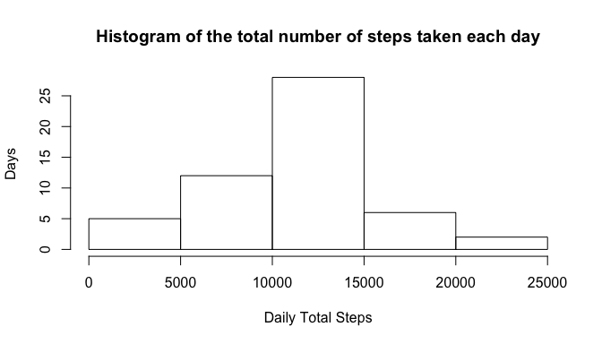
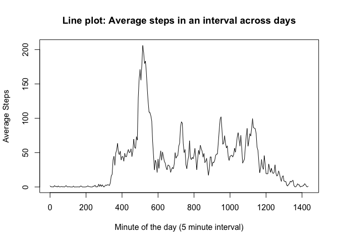
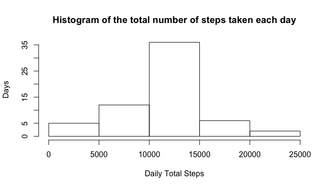
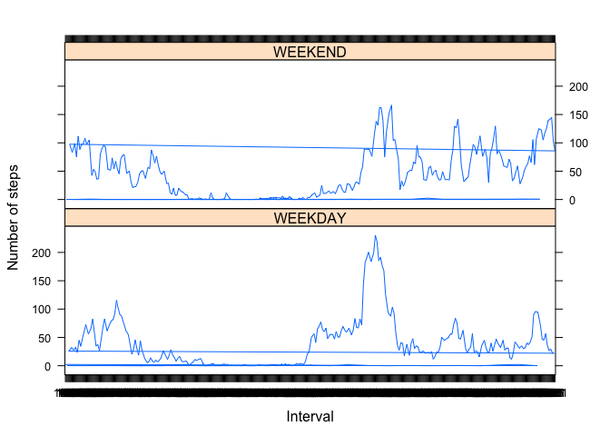

#Reproducible Research 
## Peer Assignment 1

### Loading and preprocessing the data

In the interest of making this report truly reproducible, lets get the data from the source. Use caching to make sure that it is not downloaded everytime.


```r
file <- unz("activity.zip", "activity.csv")
data <- read.csv(file, stringsAsFactors = F)
cn <- colnames(data)
data <- cbind(data, data[,3]%%100 + (data[,3]%/%100)*60)
colnames(data) <- c(cn,"minutes")
str(data)
```

```
## 'data.frame':	17568 obs. of  4 variables:
##  $ steps   : int  NA NA NA NA NA NA NA NA NA NA ...
##  $ date    : chr  "2012-10-01" "2012-10-01" "2012-10-01" "2012-10-01" ...
##  $ interval: int  0 5 10 15 20 25 30 35 40 45 ...
##  $ minutes : num  0 5 10 15 20 25 30 35 40 45 ...
```

### What is mean total number of steps taken per day?
#### 1. Calculate the total number of steps taken per day

```r
valid_data_indices <- complete.cases(data)
valid_data <- data[valid_data_indices,]
daily_sum <- cbind(by(valid_data$steps, valid_data$date, sum))
head(daily_sum)
```

```
##             [,1]
## 2012-10-02   126
## 2012-10-03 11352
## 2012-10-04 12116
## 2012-10-05 13294
## 2012-10-06 15420
## 2012-10-07 11015
```

#### 2. Make a histogram of the total number of steps taken each day

```r
hist(daily_sum, xlab = "Daily Total Steps", ylab = "Days", main = "Histogram of the total number of steps taken each day")
```

 

#### 3. Calculate and report the mean and median of the total number of steps taken per day

```r
mean_daily_steps <- mean(daily_sum, na.rm = T)
median_daily_steps <- median(daily_sum, na.rm = T)
```

The mean and median of the total number of steps taken per day are 1.0766189\times 10^{4} and 10765 respectively.

### What is the average daily activity pattern?
#### 1. Make a time series plot (i.e. type = "l") of the 5-minute interval (x-axis) and the average number of steps taken, averaged across all days (y-axis)

```r
interval_average.mat <- cbind(by(valid_data$steps, valid_data$minutes, mean))
interval_average <- as.data.frame(interval_average.mat)
interval_average[,1] <- as.numeric(interval_average[,1])
plot(y = interval_average[,1], x = rownames(interval_average), type = "l", main = "Line plot: Average steps in an interval across days", xlab = "Minute of the day (5 minute interval)", ylab = "Average Steps")
```

 

#### 2. Which 5-minute interval, on average across all the days in the dataset, contains the maximum number of steps?

```r
interval_average <- cbind(interval_average, row.names(interval_average))
colnames(interval_average) <- c("average", "interval")
ordered_interval_average <- interval_average[order(-interval_average$average),]
max_steps <- ordered_interval_average[1,1]
interval_int <- as.numeric(as.character(ordered_interval_average[1,2]))
max_step_interval <- (interval_int%/%60) * 100 + interval_int%%60
```

On an average across all the days in the dataset, interval 835 contains the maximum number of steps which is 206.1698113.

### Imputing missing values
#### 1. Calculate and report the total number of missing values in the dataset (i.e. the total number of rows with NAs)

```r
count_rows_missing_values <- sum(valid_data_indices == FALSE) 
```
The total number of rows with at least one missing value is 2304.

#### 2 and 3. Create new data frame with na values replaced with mean

```r
imputed_data <- data
for(i in 1:nrow(data)) {
  if(is.na(data[i,1])) {
    imputed_data[i,1] <- mean(data[data$interval == data[i,3],1], na.rm = T)
  }
}
count_rows_missing_values <- sum(complete.cases(imputed_data) == FALSE)
```
I used the interval average to compute missing values because day's average in most cases was not possible to compute.
The total number of rows with at least one missing value in imputed data is 0.

#### 4. Make a histogram of the total number of steps taken each day and Calculate and report the mean and median total number of steps taken per day. Do these values differ from the estimates from the first part of the assignment? What is the impact of imputing missing data on the estimates of the total daily number of steps?

```r
daily_sum <- cbind(by(imputed_data$steps, imputed_data$date, sum))
hist(daily_sum, xlab = "Daily Total Steps", ylab = "Days", main = "Histogram of the total number of steps taken each day")
```

 

```r
mean_daily_steps_2 <- mean(daily_sum, na.rm = T)
median_daily_steps_2 <- median(daily_sum, na.rm = T)
```
The mean and median of the total number of steps taken per day are 1.0766189\times 10^{4} and 1.0766189\times 10^{4} respectively, as compared to earlier values of 1.0766189\times 10^{4} and 10765 respectively.

The values do change but very slightly.

### Are there differences in activity patterns between weekdays and weekends?
#### 1. Create a new factor variable in the dataset with two levels – “weekday” and “weekend” indicating whether a given date is a weekday or weekend day.

```r
days <- weekdays(as.Date(imputed_data[,2]))
weekend <- (days == "Saturday") | (days == "Sunday")
cn <- colnames(imputed_data)
imputed_data <- cbind(imputed_data, weekend)
colnames(imputed_data) <- c(cn, "weekend")
head(imputed_data)
```

```
##       steps       date interval minutes weekend
## 1 1.7169811 2012-10-01        0       0   FALSE
## 2 0.3396226 2012-10-01        5       5   FALSE
## 3 0.1320755 2012-10-01       10      10   FALSE
## 4 0.1509434 2012-10-01       15      15   FALSE
## 5 0.0754717 2012-10-01       20      20   FALSE
## 6 2.0943396 2012-10-01       25      25   FALSE
```

#### 2. Make a panel plot containing a time series plot (i.e. type = "l") of the 5-minute interval (x-axis) and the average number of steps taken, averaged across all weekday days or weekend days (y-axis). See the README file in the GitHub repository to see an example of what this plot should look like using simulated data.

```r
weekday_data <- imputed_data[imputed_data$weekend == FALSE,]
weekend_data <- imputed_data[imputed_data$weekend == TRUE,]
interval_average.weekday <- as.data.frame(cbind(by(weekday_data$steps, weekday_data$minutes, mean)))
interval_average.weekend <- as.data.frame(cbind(by(weekend_data$steps, weekend_data$minutes, mean)))
interval_average.weekday <- cbind(interval_average.weekday, rep("WEEKDAY", nrow(interval_average.weekday)))
colnames(interval_average.weekday) <- c("average", "weekend")
interval_average.weekend <- cbind(interval_average.weekend, rep("WEEKEND", nrow(interval_average.weekend)))
colnames(interval_average.weekend) <- c("average", "weekend")
interval_average_2 <- rbind(interval_average.weekday, interval_average.weekend)
interval_average_2 <- cbind(interval_average_2, row.names(interval_average_2))
colnames(interval_average_2) <- c("average", "weekend", "minute")
library("lattice")
xyplot(average ~ minute | weekend,
           data = interval_average_2,
           type = "l",
           xlab = "Interval",
           ylab = "Number of steps",
           layout=c(1,2))
```

 
